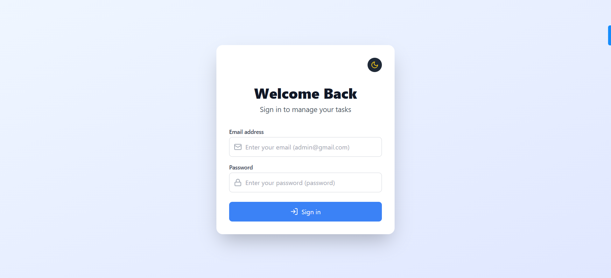
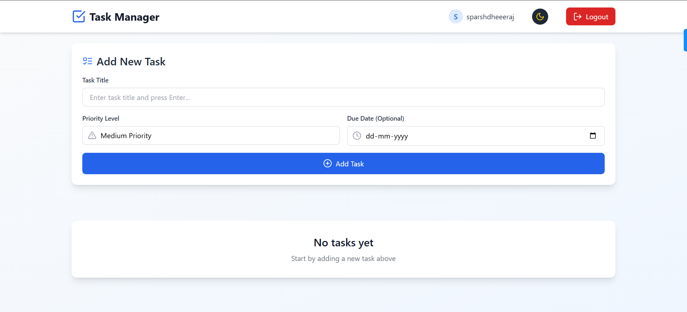
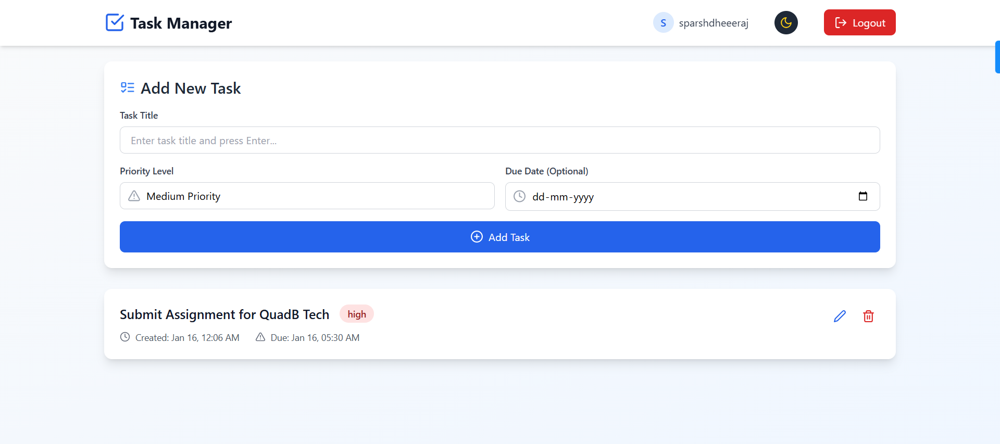
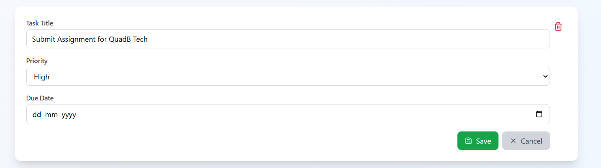
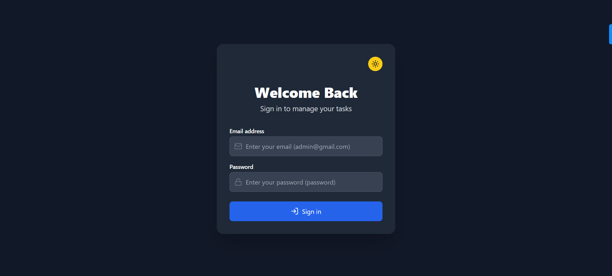
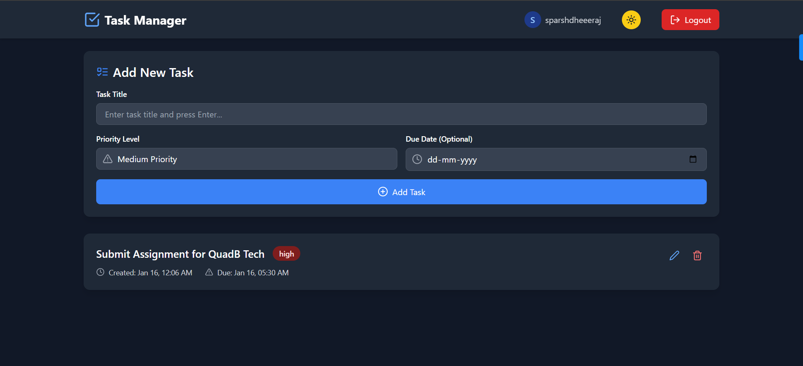

# Task Manager App

A responsive and feature-rich task management application built with **React**, **Redux Toolkit**, and **Tailwind CSS**. This app allows users to manage their tasks efficiently, offering features like task prioritization, mock authentication, and a responsive design optimized for all devices.

## Features

### Core Features
- **User Authentication**: Simulated login/logout functionality for secure task management.
- **Task Management**:
  - Add, update, and delete tasks.
  - Set task priorities (High, Medium, Low).
  - Assign due dates to tasks.
- **Persistent Storage**: Tasks are stored in `localStorage`, ensuring data persists between sessions.

### UI/UX Enhancements
- **Responsive Design**: Optimized for mobile, tablet, and desktop devices using CSS Grid and Flexbox.
- **Dark Mode**: Includes a toggle for comfortable viewing in low-light conditions.
- **Animations**: Smooth transitions and engaging animations using **Framer Motion**.
- **Interactive Interface**: Clean and minimalistic design using **Tailwind CSS** and **Lucide React** icons.

## Technologies Used
- **React**: For building the user interface.
- **Redux Toolkit**: Simplified state management and handling asynchronous actions.
- **TypeScript**: Ensures type safety and reduces runtime errors.
- **Tailwind CSS**: Provides utility-first styling for fast and responsive design.
- **Framer Motion**: Adds polished animations for a delightful user experience.

## Screenshots
Below are some screenshots showcasing the app's key features:

### Login Screen


### Add Task


### Task List


### Edit Task


### Dark Mode





## Getting Started
### Installation
1. **Clone the repository :**
   ```bash
   git clone https://github.com/sparshgupta121/Task-Manager.git
   cd Task-Manager
   ```
2. **Install dependencies :**
   ```bash
   npm install
   ```
3. **Start the development server :**
   ```bash
   npm run dev
   ```
4. **Visit the app**:
   - Visit the app: Open http://localhost:5137 in your browser.

> **Note**: Use any email with @ included in it and password can be anything.


## Deployment Link
Live App: [https://task-manager-sparsh.vercel.app/](https://task-manager-sparsh.vercel.app/)

